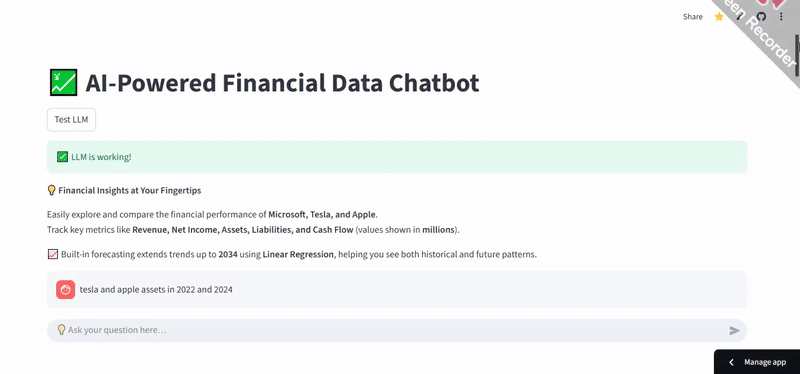

## 🎥 Demo

# 💹 Financial Data Chatbot  

An interactive Streamlit-based chatbot to explore and forecast the financial performance of **Microsoft, Tesla, and Apple**.  
The chatbot helps users query key metrics like **Revenue, Net Income, Assets, Liabilities, and Cash Flow**, with historical data (2022–2024) and **Linear Regression forecasts up to 2034**.  

---

## 🚀 Features  
- 📊 Compare **Revenue, Net Income, Assets, Liabilities, and Cash Flow** across companies.  
- ⏳ Access historical data (2022–2024).  
- 🔮 Forecast financial metrics up to **2034** using Linear Regression.  
- 💡 User-friendly chatbot interface powered by Streamlit.  

---

## 🛠️ Technologies  
- **Python**  
- **Streamlit** (interactive UI)  
- **Pandas & NumPy** (data handling)  
- **Altair** (visualizations)  
- **scikit-learn** (Linear Regression for forecasting)  
- **Hugging Face Transformers** (optional LLM support for query preprocessing)  

---

## Install dependencies

pip install -r requirements.txt

✨ Author

## ✨ Author  
👩‍💻 Developed by **Zuria Tahir**  

📬 Connect with me on [LinkedIn](https://www.linkedin.com/in/zuria-tahir-9b5078319)  

🚀 Check live demo here: [Financial Chatbot App](https://llmchatbot-pj4sljuiesjvrufpzgac3p.streamlit.app/)  
